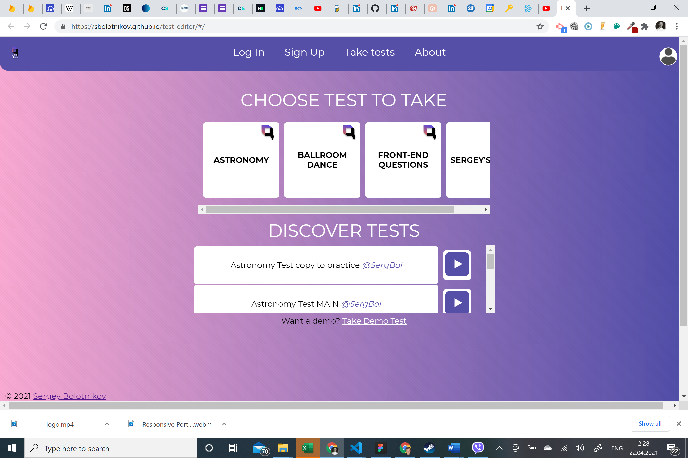
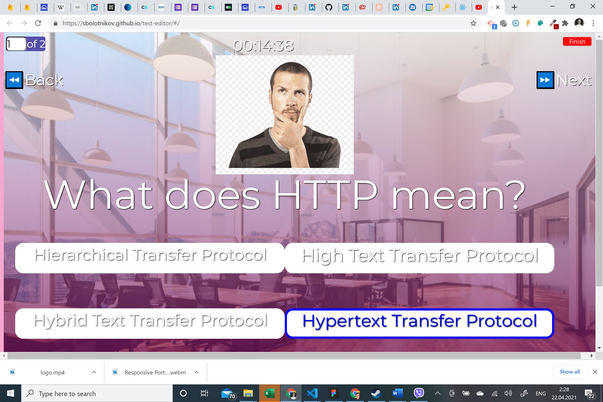
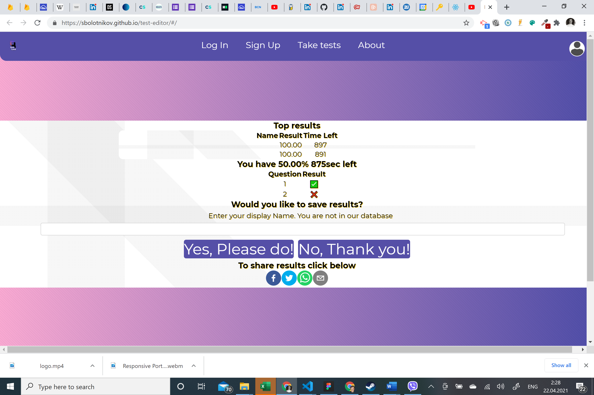
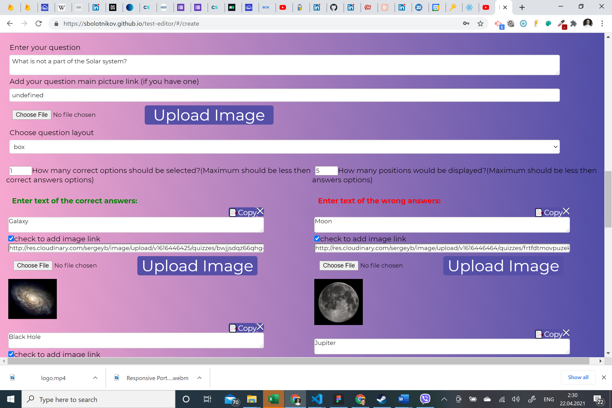
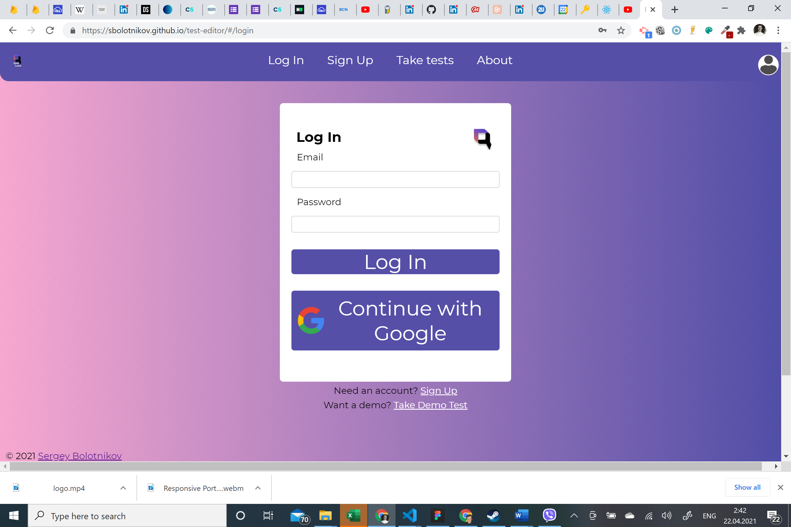

# Quiz Land 
## Description 
Quiz Land is a personal project using the Firebase DB, React stack.

Lesser technologies: cloudinary, node-sass, react-select, textfit, dotenv, and more.

This project creates a platform for editing, updating, and taking tests in many different categories and topics, ranking user’s successes in taking tests, also sharing results and tests with others on social networks, communicators, and email. All tests are randomized, that means that all answering options are changing their positions, and could be even rephrased.

Users are able to log in directly using email/password or using integration with Google OAuth. They can update their profile picture and upload pictures for the tests using cloudinary.

Manage Test page is allowing to edit, update and delete tests on our database. For safety users can download their tests to local hard drive. It is highly customized to accommodate different topics and types of test questions. All questions will fit most of the screen shapes and sizes. User friendly interface optimized for usage with mobile phones and allows to copy/paste entire questions or just one answering options.

## Table of Contents
* [Installation](#installation)
* [Usage](#usage)
* [License](#license)
* [Questions](#questions)
* [Review](#review)
## Installation 
Simply clone the repo, and/or visit the deployed page link to begin.
## Usage 
Here is the video tutorial link: https://youtu.be/x116B9S0tX4

### Main Page:Choosing the test
 

### Example of a question displayed
 

### Example of Results Page after test
 

### Test Editing Page: Example of question editing
 

### Example of the Log In page
 

## Contributing 
 None 
## License 
 Licensed under MIT License. 
## Tests 
 None
## Questions 
 You can see more of my Projects on my [GitHub profile](https://github.com/sbolotnikov) 
 Contact me with any questions or suggestions!
 * Sergey Bolotnikov [sbolotnikov](mailto:sbolotnikov@gmail.com)
## Review 
  * Here is this repo link: https://github.com/sbolotnikov/test-editor
 
  * Link: [Quiz Land](https://test-editor-qbm4.onrender.com/)